# A2-Calculator-Desktop

**A2 Calculator Desktop** — an easy-to-use locksmithing tool for pinning A2 systems.  
Available for **Windows, Mac, and Linux**.

---

## Features
- Supports both **6-pin** and **7-pin** A2 systems  
- Simple, clean interface for quick calculations  
- Automatically applies proper pinning rules  
- Desktop version (no internet required once installed)  
- Installer available for Windows (.exe) — Mac and Linux builds coming soon  

---

## Installation

### Windows
1. Go to the **[Releases page](../../releases)**.  
2. Download the latest `.exe` file.  
3. Run the installer and follow the prompts.  

### Mac / Linux
- Build instructions and installers coming soon.

---

## Usage
1. Launch **A2 Calculator Desktop**.  
2. Choose **6 Pin Calculator** or **7 Pin Calculator**.  
3. Enter your master key, change key, and control key cuts.  
4. The calculator will generate the pinning chart for you.  

---

## Screenshots

## 📸 Screenshots

### Opening Screen
This is the opening screen where the user chooses **6 pin**, **7 pin**, or sees the "coming soon" option.  

  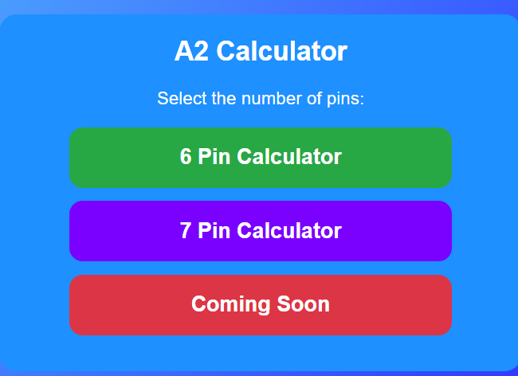

### Wizard Screen
After choosing the 6 pin calculator, this screen lets the user decide whether to use the wizard.  

  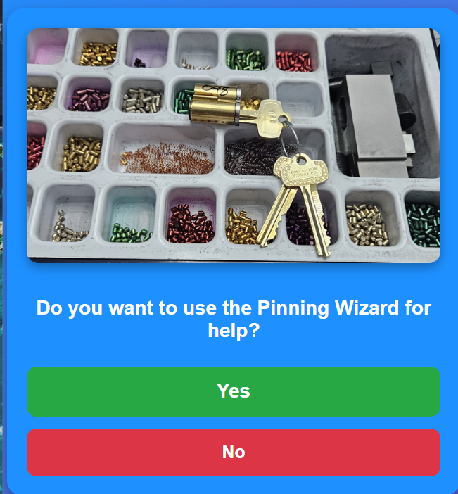

### Wizard – Master Key Input
This is the wizard screen waiting for the **master key** to be filled in.  

  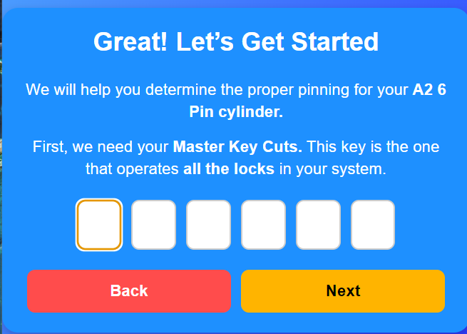

### Wizard – Master Key Filled
This shows the wizard screen with the **master key filled in**.  

  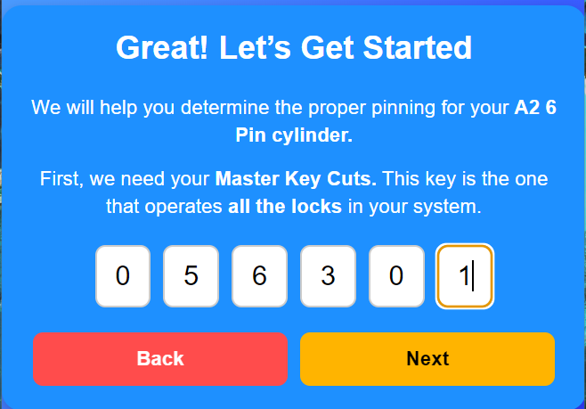

### Change Key Input & Error
On the change key screen, notice the **warning message** at the top.  
A change key cut cannot be only **1 cut larger or 1 cut smaller** than the master key cut.  
If that happens, an error screen is displayed.    

  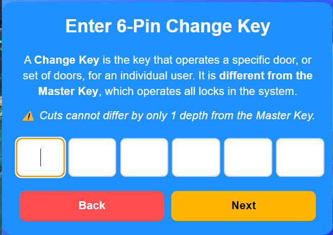
  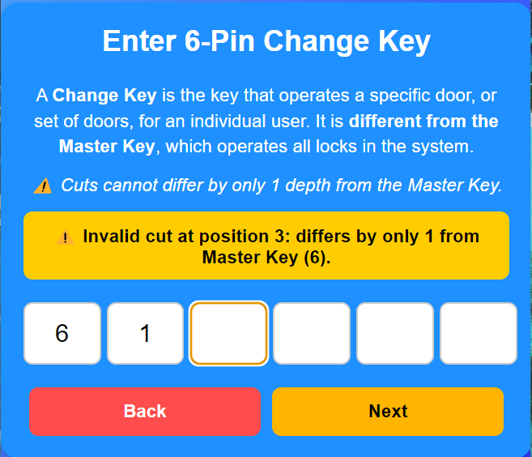

### Change Key Filled
After correcting the error and filling in all cuts, the change key screen is complete.  

  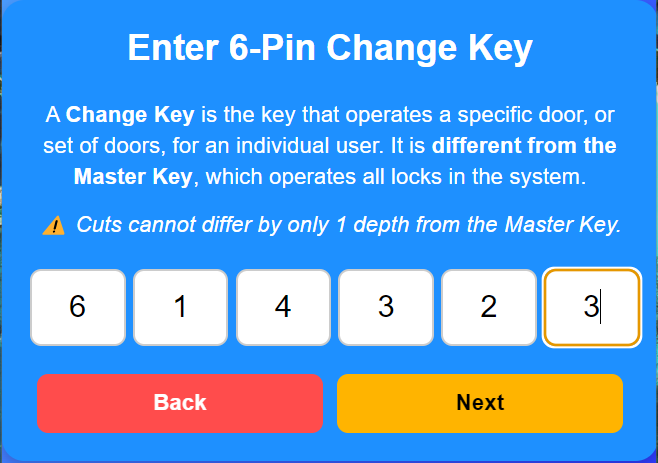

### Control Key Input
The next screen allows the user to enter the **control key**.  

  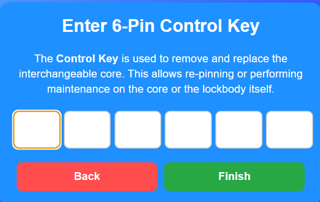

### Control Key Filled
This shows the control key screen once all cuts are entered.  

  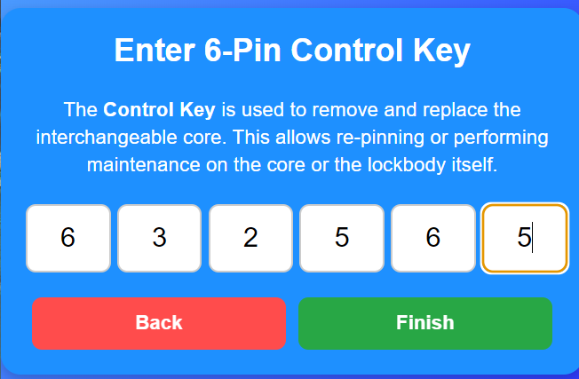

### Results Screen
Finally, pressing the green **Finish** button shows the results screen. This explains how to properly pin up the A2 cylinder so that the **master**, **change**, and **control keys** all work correctly.  

  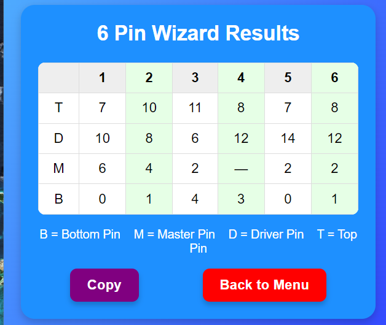

### Without Wizard – Input
If the user chooses **not** to use the wizard, this screen appears. Here, all inputs are filled in except the last control number.  

  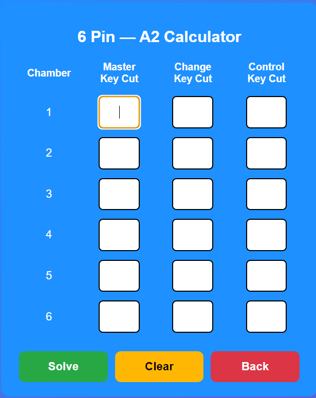

### Without Wizard – Results
Once the final control number is entered, the app automatically advances to this results screen (without wizard).  

  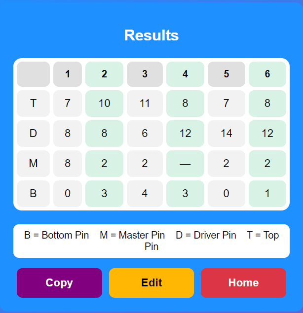

---

## Future Plans
- Mac and Linux installers  
- Additional SFIC/LFIC calculator modules  
- Automatic update checker  

---

## License
This project is licensed under the **MIT License**.  
See the [LICENSE](LICENSE) file for details.

---

## Author
Developed with pride by **Jerry “The Unicorn” Dionisio** 🦄  
Locksmith • Developer • Author of *It’s Just a Zit… RIGHT?*  

If you find this tool helpful, consider sharing it with other locksmiths or leaving feedback.  
